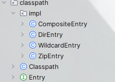
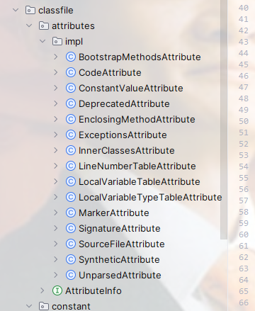
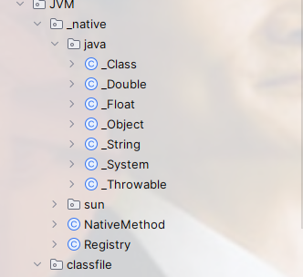

# JVM
## Command Tool
this project is used maven by default

First we sure implement the java command, such as the java --version and so on.

we sure reference the maven of 
```xml
<dependency>
  <groupId>com.beust</groupId>
  <artifactId>jcommander</artifactId>
  <version>${your version}</version>
</dependency>
```
then run with the environment variables with your command

and the demo is : to parse your command
```java
 @Parameter(names = {"-?", "-help"}, description = "print help message", order = 3, help = true)
    boolean helpFlag;

    @Parameter(names = {"-Xms"}, description = "init heap size")
    String Xms;

    @Parameter(names = {"-Xmx"}, description = "max heap size")
    String Xmx;

    @Parameter(names = "-version", description = "print version and exit", order = 2)
    boolean versionFlag = false;

    @Parameter(names = "verbose", description = "enable verbose output", order = 5)
    boolean verboseClassFlag = false;
    @Parameter(names = {"-cp", "-classpath"}, description = "classpath", order = 1)
    String classpath;

    @Parameter(description = "main class and args")
    List<String> mainClassAndArgs;

    @Parameter(names = "-args", description = "ext in args", order = 6)
    String args;

    boolean ok;

    @Parameter(names = "-Xjre", description = "path to jre", order = 4)
    String jre;
    String getMainClass() {
        return mainClassAndArgs != null && !mainClassAndArgs.isEmpty() ? mainClassAndArgs.get(0) : null;
    }

    List<String> getAppArgs(){
        return mainClassAndArgs != null && mainClassAndArgs.size() > 1 ? mainClassAndArgs.subList(1, mainClassAndArgs.size()) : null;
    }

    static Cmd parse(String[] args) {
        Cmd cmd = new Cmd();
        JCommander build = JCommander.newBuilder().addObject(cmd).build();
        build.parse(args);
        cmd.ok = true;
        return cmd;
    }
```
## use the JDK's jar to parse your class file
this implementation is use the JDK's /lib/jar to parse your class

first is to declare a base class of the Entry and the other special class like Dir or Zip implement the Entry,this like the strategy mode

directory constructor is :


you can clone the project and see how they implement. cause of if have many code ,that i can't show the code details

### Parse the class file 
First, you should know the details about the jvm's attribute

So,our job is to wirte the base Attribute, like the method,Constant value ,inner class,and so on.

this is the directory constructor 



similary, we usually use the strategy mode to implement it , and the details is in the code

### define the base data structure
as the class data size , u1 is 8byte and u2 is 16 byte,and u4 is 32

our's object is to implement this data structor

and the base directory is the 


### runtime data area
the runtime data area include the Program Counter and JVM stack ,and the JVM stack include the Frame, and we should implement this function

### Instructions and interpreters
then the most important is the Instructions and interpreters. this is the assembly

### Class and object
the next is the Class and Object, when we write the program, we alwary write the class and new a object in some class, we should implement those function

### invoke method
then we should implement the method invoke.

### final function of the native invoke
the jvm contain the native method,such as the c function or cpp function,we should implement thos function

all things in this case is end ,those is the easy jvm function, include the base data class method and so on.